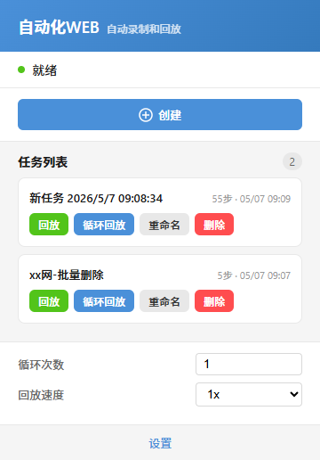

# 自动化WEB - 自动录制和回放

一款完全由人工智能（AI）编写的浏览器自动化操作插件，能自动记录用户的鼠标键盘动作，并支持回放，代替用户执行重复的劳动。

> 简约好用，重复工作更轻松。

## 📝 功能特点

- **操作录制**：自动记录用户的鼠标点击、键盘输入等操作
- **智能回放**：精确重现用户的操作序列
- **循环执行**：支持设置循环次数，自动重复执行任务
- **快捷键启动**：自定义快捷键快速启动录制或回放
- **单步调试**：支持暂停、继续、单步执行等调试功能
- **任务管理**：保存、加载和管理多个自动化任务
- **跨页面支持**：支持跨多个网页的操作录制和回放
- **页面刷新处理**：智能处理页面刷新和导航事件

## 图片展示

## 📖 使用说明

### 录制操作

1. 点击浏览器工具栏中的插件图标
2. 点击「创建」按钮
3. 执行您想要自动化的操作
4. 完成后点击「结束录制」按钮

### 回放操作

1. 点击浏览器工具栏中的插件图标
2. 在任务列表中找到您要回放的任务
3. 点击「回放」按钮
4. 使用控制面板进行暂停、继续或单步执行

### 管理任务

1. 点击浏览器工具栏中的插件图标
2. 在任务列表中可以查看、删除或重命名已保存的任务
3. 使用悬浮栏可以查看当前网站的所有可用任务

### 循环执行

1. 在任务列表中选择要循环执行的任务
2. 在回放设置中输入循环次数
3. 点击「循环回放」按钮开始执行
4. 任务将按设置的次数自动重复执行

### 定时执行

1. 在任务列表中选择要定时执行的任务
2. 点击「定时设置」按钮
3. 设置执行时间（支持单次或重复执行）
4. 确认后插件将在指定时间自动启动任务

### 快捷键启动

1. 打开插件设置页面
2. 进入「快捷键」配置
3. 设置录制和回放的快捷键
4. 按下设置的快捷键即可快速启动对应功能

